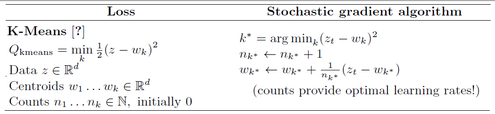
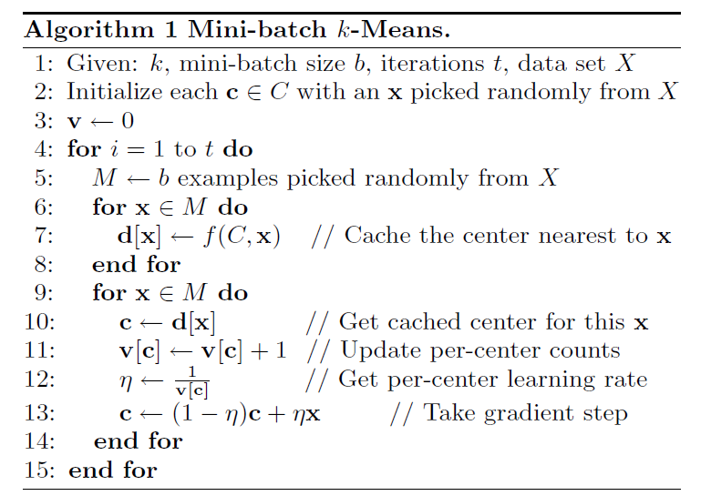
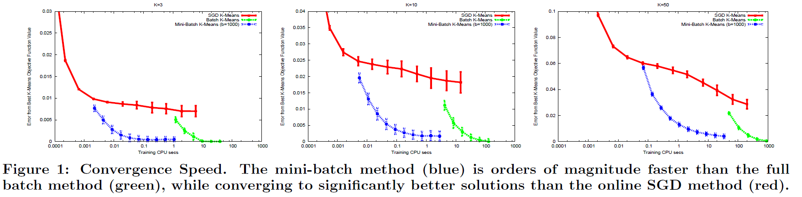

## Algorytmy k-średnich

## Algorytm mini batch

## Wyniki 

## Bibliografia

*Stochastic Gradient Descent Tricks*, Leon Bottou, Microsoft Research, Redmond, WA, 2012

*Web-Scale K-Means Clustering*, D. Sculley, Google, Inc. Pittsburgh. PA USA, 2010